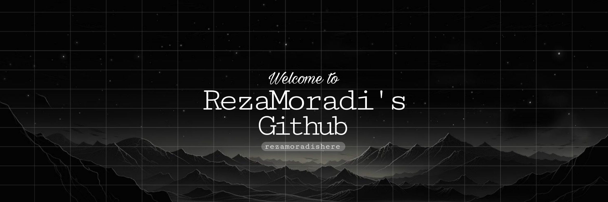

<h2 align="center">✨ About Me ✨</h2>

Hello There :)  
I'm Reza Moradi, Frontend developer and intersted in the computer world.  
I'm not just a frontend developer!!!, I'm learning and research about digital science.

 
<h2 align="center">✉️ Connect with me ✉️</h2>

Follow me if you can :)

    
    

 
<h2 align="center">💻 Tech Stack 💻</h2>

    
    
    
    
    
    
    
    
    
    

